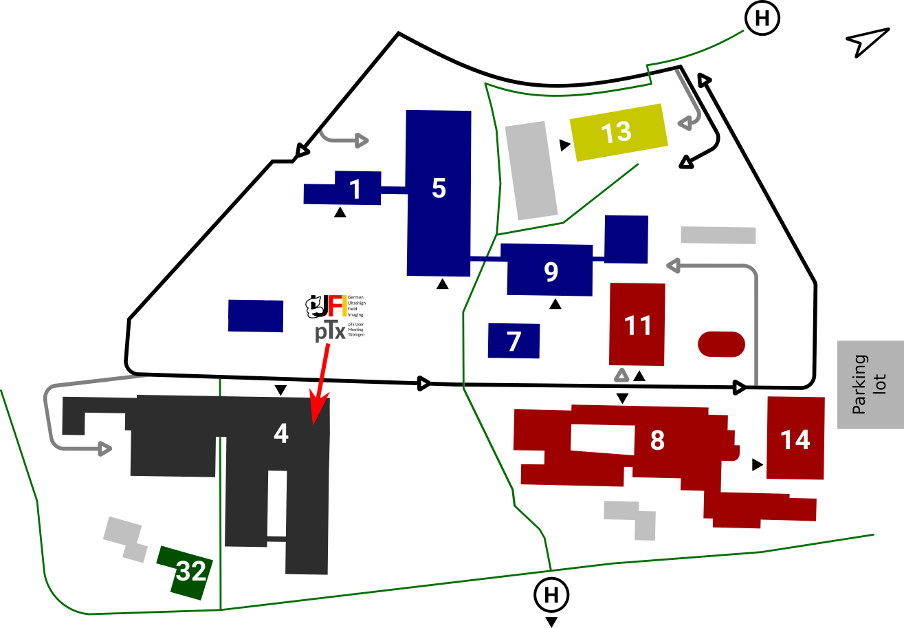

# How to get to the workshop
[Back to main page](index.md)

We recommend travelling by public transport. If you, however, come by car, parking options will be available.

## By Train
Intercity trains, including the high-speed ICE service, will take you to Stuttgart’s main train station, from which a local train service will reach Tübingen in about an hour. The Max Planck Campus can be reached by taxi (~10 minutes) or by bus (~20 minutes) from Tübingen’s main train station. Both the bus station and the taxi service are located directly opposite to the main exit of Tübingen’s train station.

## By Bus
Starting at the main station in Tübingen with bus no. 3 in the direction of “Ulmenweg” to the bus stop "Max Planck Institute" it takes about 15 minutes to reach the campus. From the bus stop you need to walk about 100 meters downhill 

## By Plane
The nearest airport to Tübingen is Stuttgart (STR). After arrival, one option is the "[Airportsprinter](https://www.dbregiobus-bawue.de/angebot/rbb-Airport-Sprinter-en)” (Bus 828), which will take you directly to the main station in Tübingen (journey time is about one hour, price ca 8€). Another option is to take a taxi from the airport. The taxi ride takes 30 to 40 minutes and will cost approximately 100€. 

## By Car
There is a parking lot next to Max Planck Ring 14, 72076 Tübingen.
Please get in touch with us so we can get you a parking permit.

